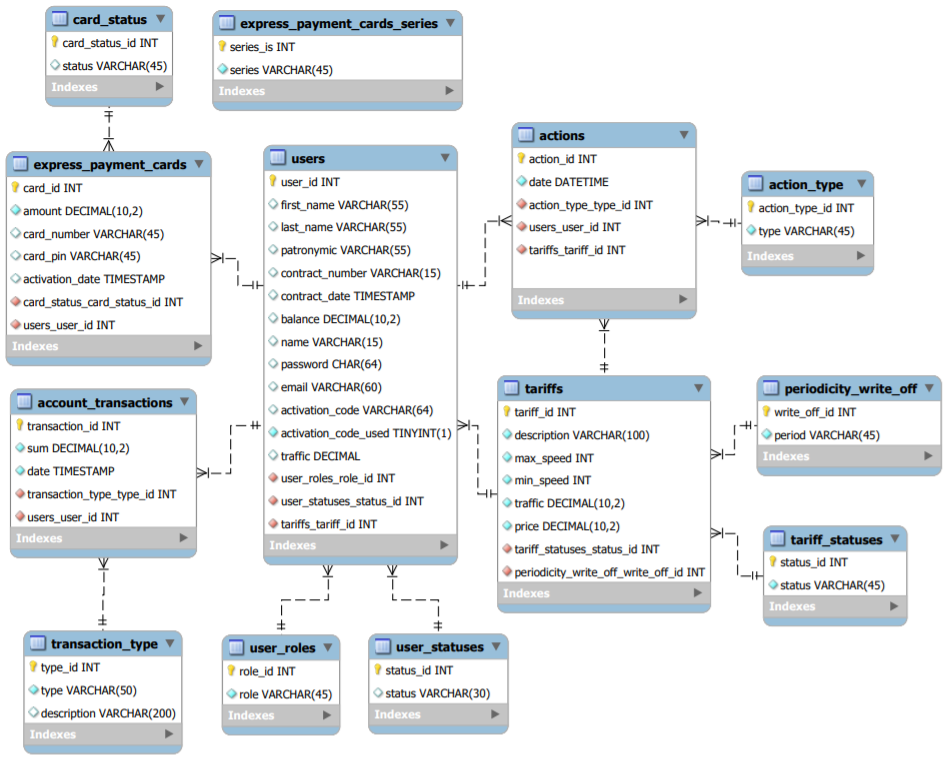

Final project in Java EPAM course in Minsk, Belarus. 

# Internet Service provider

#### The system allows you to keep records of customers, user balance, a list of tariffs, service payment cards and basic analytical statistics. The system also records all actions performed under a user contract and financial transactions. The system has 3 types of roles: Guest, User, Admin.

### Guest role
- Go to the login page
- Authenticate with login and password
- Change locale
### User role
- Go to the home page
- Change locale
- Log out
- View profile information
- View transactions list
- View actions list
- View information about the tariff used
- View list of tariffs allowed for activation
- Change password
- Change tariff
- Ability to activate account
- Replenish the account of the payment card
### Admin role
General
- Go to the home page
- Change locale
- Log out

Tariff
- Add tariff
- Edit tariff configuration
- Change tariff status
- View list of all tariffs

User
- Add user
- Edit user personal information
- Change user role
- Banned and Unbanned user
- View users profile
- View users transactions lists
- View users actions lists
- Search users by parameters

Payment card
- Add batch of cards
- Search users by card number
- Check payment card status
- Check payment card activation information

Statistic
- View count of users on the tariff
- View users in the system by account status
- View total cards issued for all time
- View total not activated payment cards in the system

Architecture:
```
MVC
```
Technologies:

Front end
```
Java JSP
JSTL
Taglib (custom tag)
HTML
Bootstrap
CSS
```
Back end:
```
Java servlet
Java JDBC
SQL
Transactions
ThreadLocal
```
Test:
```
TestNG
Mockito
Easymock
```
Logging:
```
Log4j2
```
Data base
```
Mysql
```

Database structure



